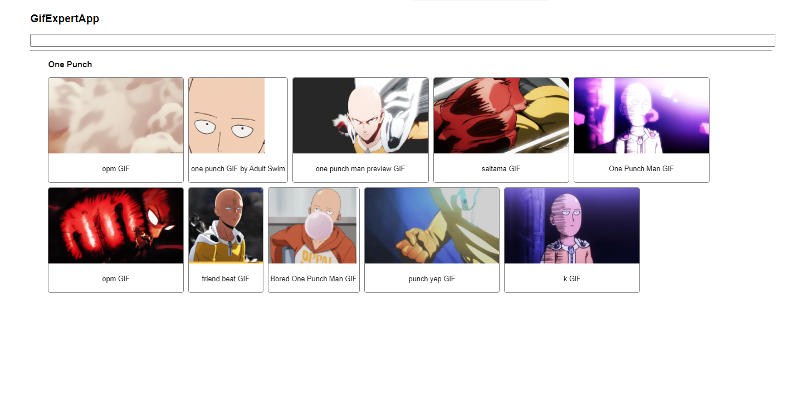

## Gif Expert App

En este proyecto, se utiliza las siguientes características de React Js:

- Custom Hooks.

- Fetch hacia un API.

- Comunicación entre componentes.

- Clases de CSS.

- Animaciones.

- Enviar métodos como argumentos.

- Crear listados.

- keys.

- Giphy

# Screenshot

